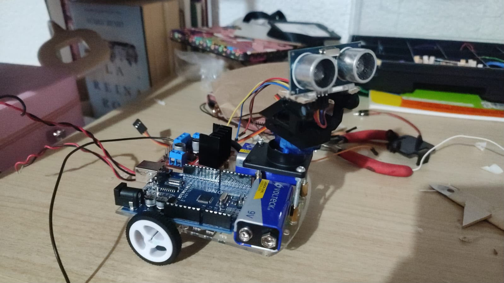
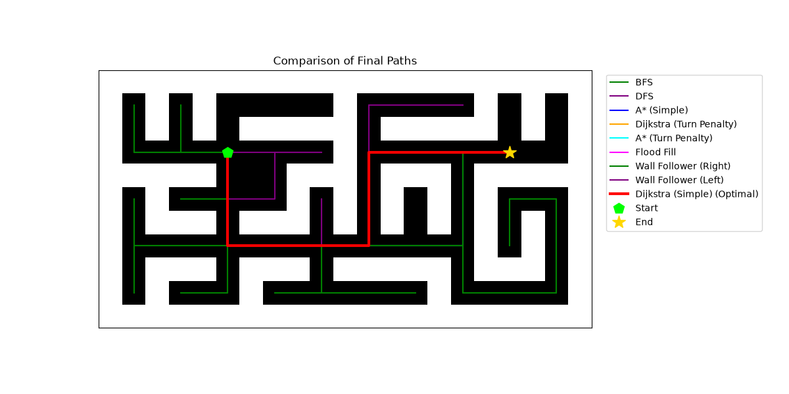

# Autonomous Maze-Solving Rover: Hybrid Path-Planning & Embedded Control

> **Note:** This repository documents an open-loop control system architecture that combines massive graph-search algorithm evaluation in Python with non-volatile memory persistence and hardware motor control in C++.

---

## 1. Visual Demo & Real-World Execution

### Hardware in Action
Click the image below to watch the autonomous rover navigating the physical maze:

[](https://www.youtube.com/shorts/RDXdN0vD5-4)

### Algorithmic Evaluation
The decision-making engine executes a competitive benchmark to evaluate multiple topological routes before establishing serial communication.



---

## 2. Technical & Algorithmic Foundations

The primary optimization metric of this software is the **Total Kinematic Cost**. Traditional abstract path-finding models measure strictly distance. This system implements a physical heuristic that penalizes rover rotations, optimizing real-world friction, inertia, and the time required for the L298N motor driver to rotate on its own axis.

### Uninformed & Physical Search
- **BFS & DFS:** Baseline algorithms mapping the absolute area.
- **Wall Follower:** Classic reactive maze navigation logic (Right/Left hand rules).

### Advanced Heuristic Search
- **Dijkstra & A* (A-Star):** Both algorithms were heavily modified to accept a `turn_cost` parameter.
- **Kinematic Penalty:** The algorithm evaluates the vectorial direction change between the previous node and the current node. It sums a penalty cost if the vehicle is forced to rotate, ensuring the instruction string sent to the microcontroller is mechanically optimal.
- **Manhattan Distance:** The A* algorithm utilizes the Manhattan heuristic to estimate the cost to the target:

$$H(a, b) = \vert{}x_a - x_b\vert{} + \vert{}y_a - y_b\vert{}$$

---

## 3. Engineering Challenges & Solutions

### The Hardware-Software Communication Bridge

**Challenge:** Translating Cartesian grid coordinates into asynchronous spatial instructions understandable by a low-resource microcontroller.

**Solution:** Developed a vector transformation module (`utils.py`) that calculates the position differential ($dr, dc$) and the rover's current orientation (0-360 degrees). It translates the calculated grid path into a strict character protocol: `F` (Forward), `R` (Right), and `L` (Left). A Python interactive orchestrator then establishes a Serial connection for command transfer.

### Memory Management in Embedded Systems

**Challenge:** Providing true autonomy so the robot does not rely on an active wired or Bluetooth connection to a master computer during its physical run.

**Solution:** Direct non-volatile memory access. The C++ firmware incorporates interactive preprocessing commands:
- `!S<ranking>`: Receives the optimal route from the Python ranking, executes it in RAM, and injects it directly into the EEPROM physical registers.
- `!E`: Triggers the EEPROM read routine. Allows the user to disconnect the rover from the computer, place it at the physical maze entrance, and autonomously execute the stored optimal route.
- `!C`: Clears the memory bank.

---

## 4. Software Architecture

We opted for a modular architecture with a strict Separation of Concerns between mathematical algorithms, graphical rendering, and hardware control.

```text
.
├── src/                      
│   ├── main.py               
│   ├── algorithms.py         
│   ├── communication.py      
│   ├── visualization.py      
│   └── utils.py              
│
├── firmware/                 
│   └── car_instructions/
│       └── car_instructions.ino
│
├── assets/                   
│   ├── rover_execution.jpeg
│   └── exploration_*.png     
│
├── pyproject.toml            
├── uv.lock                   
├── LICENSE
└── README.md
```

### Linux Production Standards

> **Tested and Optimized for Debian Linux environments.**

This project adheres to modern standard package management using `uv` for lightning-fast dependency resolution and environment isolation.

---

## 5. Installation & Usage

### 5.1. Clone and initialize:
```bash
git clone https://github.com/Schronding/heuristic-embedded-maze-solver
cd heuristic-embedded-maze-solver
uv sync
```

### 5.2. Flash the Firmware:
Upload the `firmware/car_instructions/car_instructions.ino` script to your microcontroller target using the Arduino IDE or `arduino-cli`.

### 5.3. Run the decision pipeline:
```bash
uv run src/main.py
```